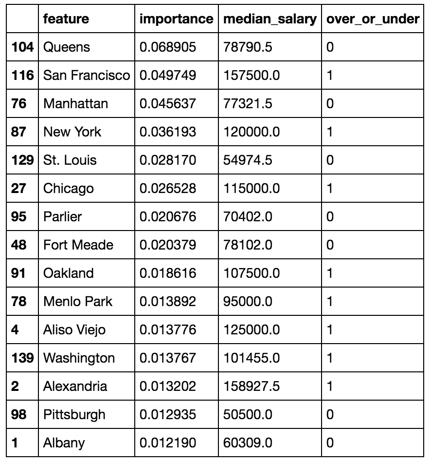
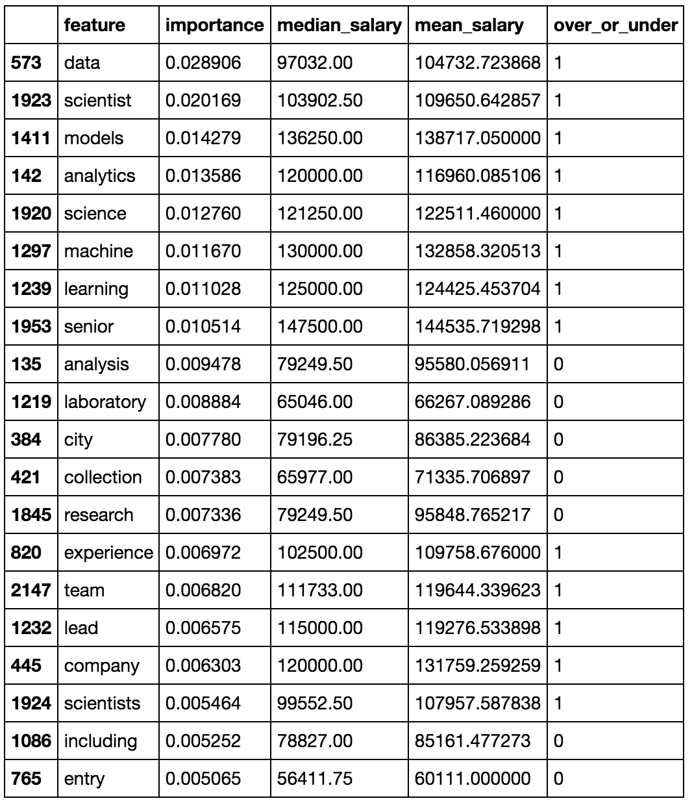
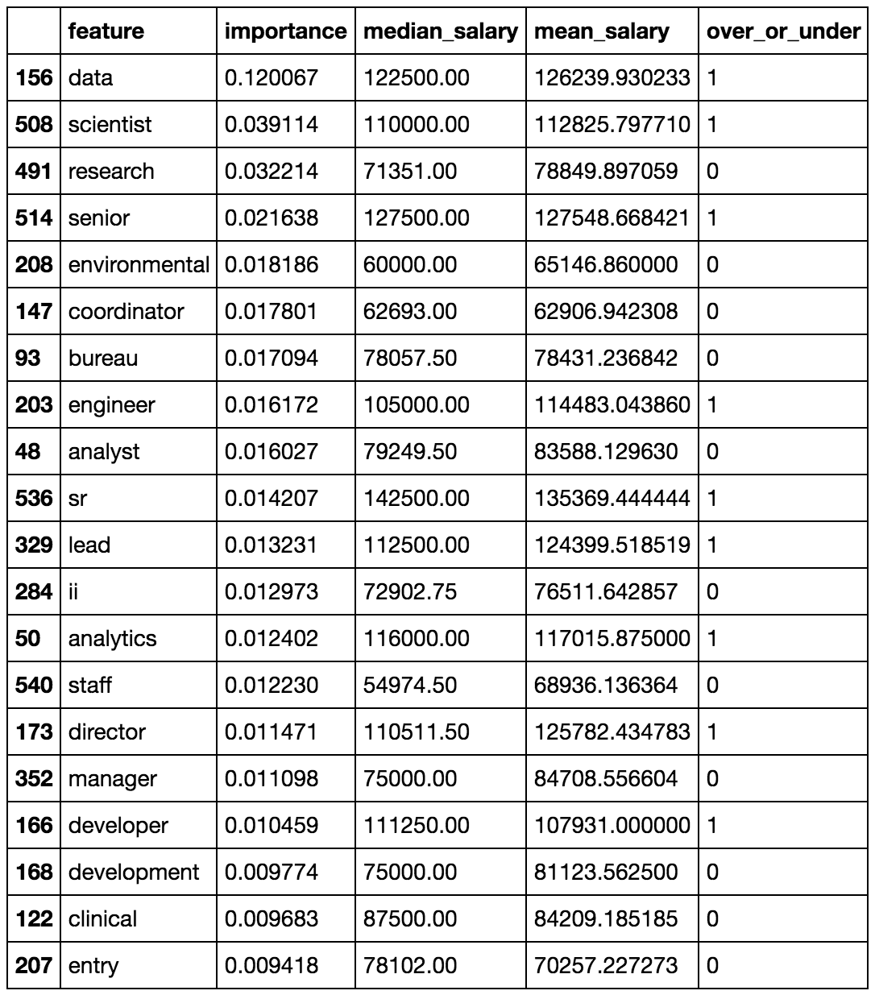
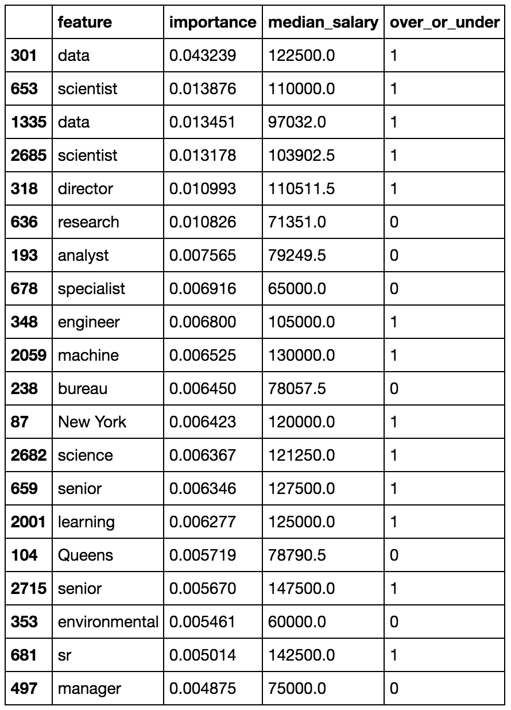

# Indeed-Web-Scrapping-Analysis-and-Salary-Prediction
Indeed has a great collection of relevant jobs and a nice set of filtering options. But finding full time jobs is kind of a mess because of the wider range of job type that all fall under the same umbrella.

First, There are almost way too many results to manually look through. Second, even though I filter for entry level jobs, the description often has a minimum work ex requirement — while It may not necessarily be entry level = 0 work experience, but having jobs with requirement of 5+ years under entry level is doing no good to anyone. Third, I would eventually stumble upon Intern positions — again not what I am looking for. Finally, it takes too much time, I’ve already filtered and filtered and I still find results that do not work for me.

If only I could do this entire chore of going through each and every job title, job description and eliminating unsuitable ones and consolidating the right ones in one place. Well, yes I can, with Python. I consider Python to be a great automation tool

In this project, I scraped Indeed.com for data on job (titles, salaries, locations, summaries of job description), analyzed the data I scraped and predicted salary using random forest binary classifier. Most listings do not come with salary information, but being to able extrapolate and predict the expected salaries from other listings can help guide negotiations or at least get an insight of what to expect if you are new to the job market like me. 

### Overview of data :
* There are 630,988 results found for Data Scientist from my list of 86 cities. 
* 590,466 jobs (93.58%) with no salary
* 615,441 (97.54%) of the entries are duplicated
* The salaries are given as text and usually with ranges

### Results:
The accuracy score and across validation score of each Random Forest models:

|Features Used|Accuracy|Cross Validation|
|------|------|------|
|City|0.655|0.538 ± 0.108|
|Summary|0.704|0.731 ± 0.065|
|Title|0.805|0.804 ± 0.057|
|All 3 above|0.81|0.77 ± 0.073|

Below are the predicticted salary for each feture used:

#### City

#### Job Summary

#### Job Title

#### Combination of city, job summary and job title:

